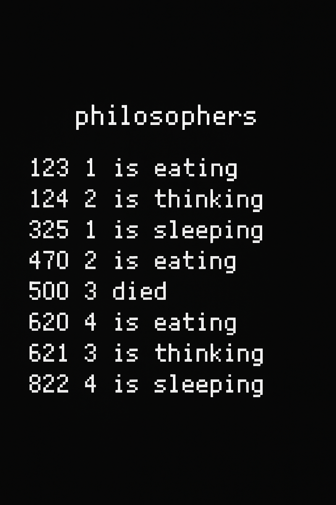

# Philosophers



## About the Project

**Philosophers** is a concurrency-based project from the 42 curriculum that simulates the classic **Dining Philosophers Problem** 🧠🍝  

The goal: manage multiple philosophers sitting at a table, each alternating between **thinking**, **eating**, and **sleeping**, while avoiding **deadlocks** and **data races** — all using **threads** and **synchronization mechanisms**.

This was my first deep dive into **multithreading** and **concurrent programming**, exploring both the mandatory and **bonus** parts with semaphores and monitoring threads.  

---

## 🧩 What I Learned

- Using **POSIX threads (pthreads)** to create and manage concurrent tasks.  
- Synchronizing threads with **mutexes** and **semaphores**.  
- Implementing **precise timing** and preventing **race conditions**.  
- Detecting **death conditions** using a **monitoring thread**.  
- Understanding and handling **deadlocks**, **starvation**, and **thread safety**.  
- Structuring concurrent logic in a clean, readable, and efficient way.

---

## ⚙️ Features Implemented

### ✅ Mandatory Features
- Each philosopher is a **thread**.
- Shared resources (forks) are protected by **mutexes**.
- Each philosopher:
  - **Thinks**, **eats**, and **sleeps** in a loop.
  - Dies if they don’t eat within the specified time (`time_to_die`).
- Input validation and error handling.
- Accurate timing for actions and logging.

### ⭐ Bonus Features
- Philosophers implemented using **processes** and **semaphores**.
- A **monitoring thread** detects if a philosopher has died.
- Proper cleanup of semaphores and processes.
- More stable handling of concurrent events (almost fully polished 👀).

---

## 🖥️ How to Use

Clone the repository and compile:

```bash
git clone https://github.com/PedroLouzada/philosophers.git
cd philosophers
make
```

### ▶️ Run the program

```bash
./philo number_of_philosophers time_to_die time_to_eat time_to_sleep [number_of_times_each_philosopher_must_eat]
```

### Example:
```bash
./philo 5 800 200 200
```
➡️ 5 philosophers  
➡️ Each dies after 800ms without eating  
➡️ Eats for 200ms  
➡️ Sleeps for 200ms  

For the bonus version (with semaphores):
```bash
make bonus
./philo_bonus 5 800 200 200
```

---

## 🔍 Rules of the Simulation

- Each philosopher must **take two forks** to eat.  
- Philosophers **can’t eat at the same time** if they share a fork.  
- If a philosopher doesn’t eat before `time_to_die`, they **die**.  
- Simulation stops immediately after a philosopher dies (or all finish eating).  
- All actions are logged with timestamps.

---

## 🚀 Future Improvements

- Fine-tune timing precision for very low time values.  
- Improve polish on bonus version (smoother semaphore control).  
- Add visual interface or logging to visualize states in real time.  
- Experiment with alternative synchronization techniques (e.g., condition variables).  

---

## 💡 Final Thoughts

Philosophers was one of the most **mind-expanding** 🧠💥 projects at 42 so far.  
It taught me how **threads** and **synchronization** work under the hood, and how to think about **parallelism**, **timing**, and **resource sharing** like a true systems programmer.  

If you’re about to start this project — embrace the chaos 🍽️, it’s an incredible mix of logic, precision, and problem-solving!

---

## 📬 Contact

Feel free to reach out:

[GitHub](https://github.com/PedroLouzada)
